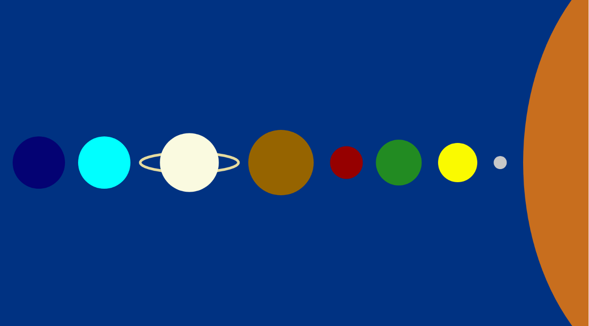
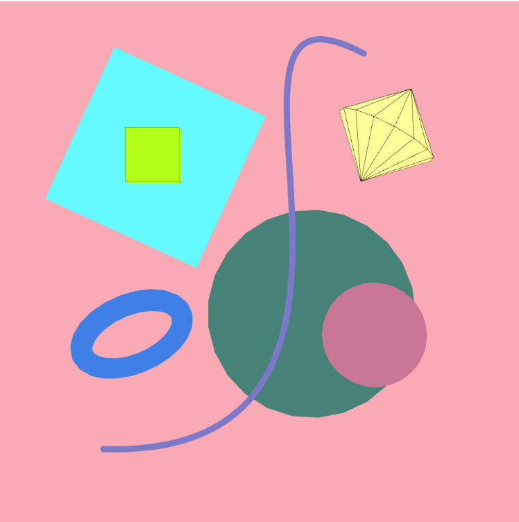
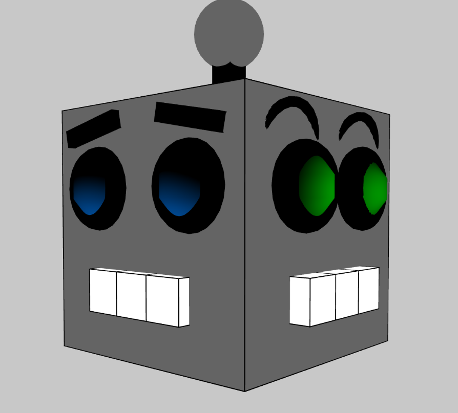

# Cart 253 Fall 2026

:sparkles: This website collects and showcases my prototyping work during the course while documenting my progress and learning. :sparkles:

## Useful links !

[Journal](journal.md)

## All my challenges

- [Instructions-challenge](topics/challenges/instructions-challenge/)
- [Instructions-challenge](topics/challenges/variables-challenge/)

## All my prototypes

## Instructions assignement

### The Solar System

[The Solar System](https://leyfa01.github.io/cart253/topics/prototypes/instructions/instructions-prototype-1/)

[The Solar System Repositary](https://github.com/leyfa01/cart253/tree/main/topics/prototypes/instructions/instructions-prototype-1/)

### Geometric Chaos

[Geometric Chaos](https://leyfa01.github.io/cart253/topics/prototypes/instructions/instructions-prototype-2/)

[Geometric Chaos Repositary](https://github.com/leyfa01/cart253/tree/main/topics/prototypes/instructions/instructions-prototype-2/)

### Mood Bot

[Mood Bot](https://leyfa01.github.io/cart253/topics/prototypes/instructions/instructions-prototype-3/)

[Mood Bot Repositary](https://github.com/leyfa01/cart253/tree/main/topics/prototypes/instructions/instructions-prototype-3/)
