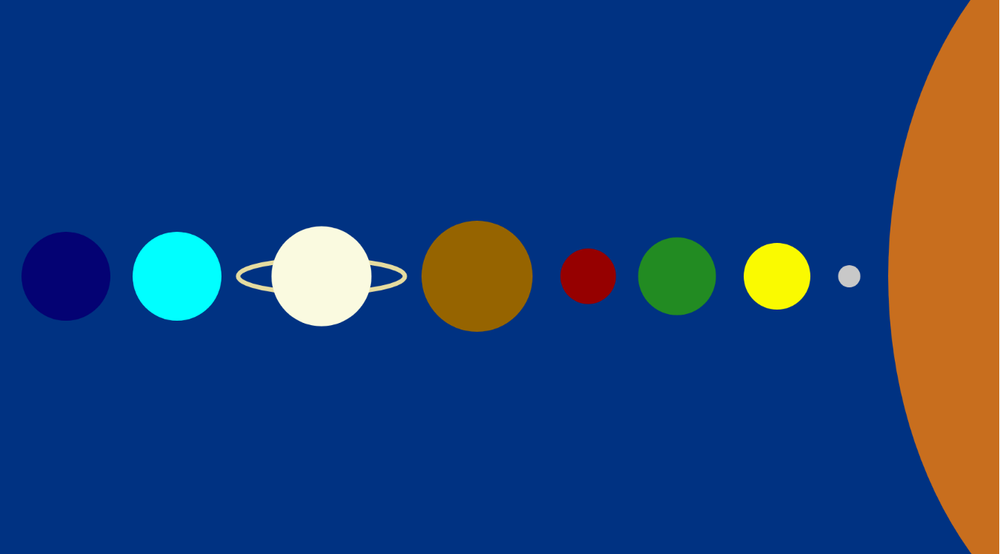
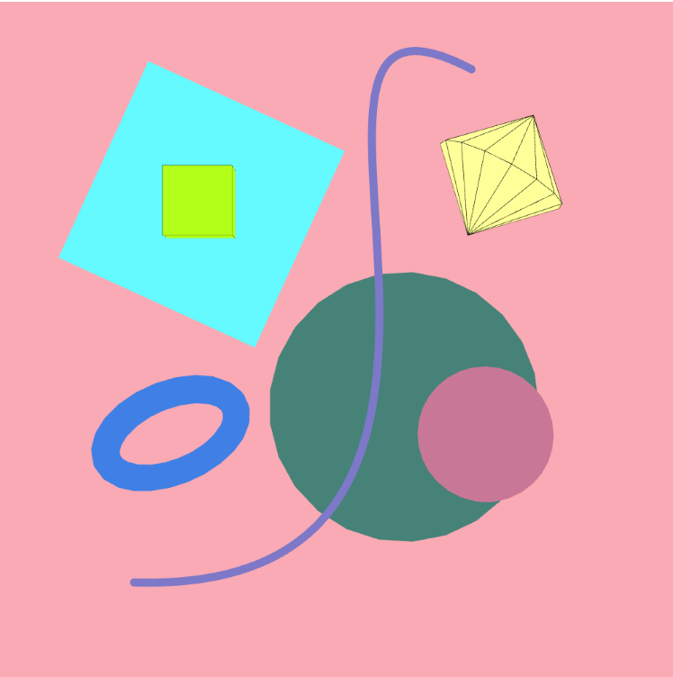
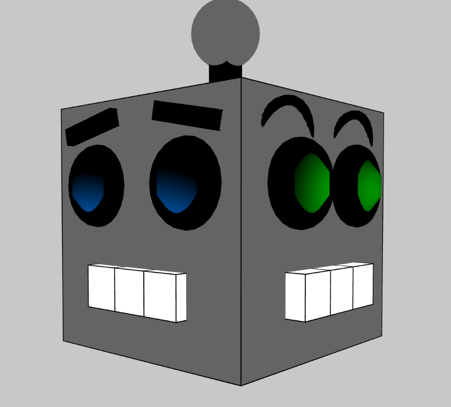
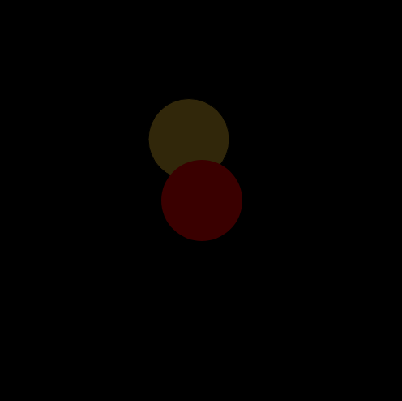
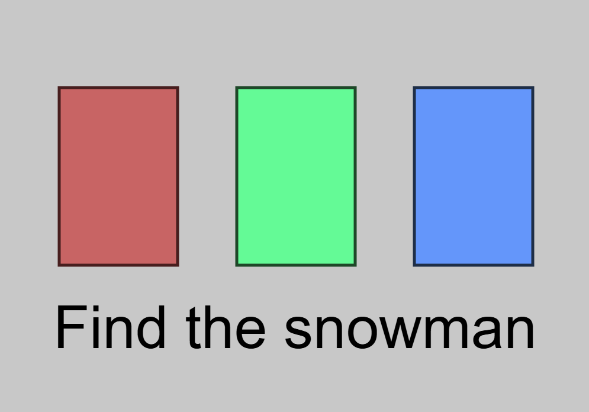
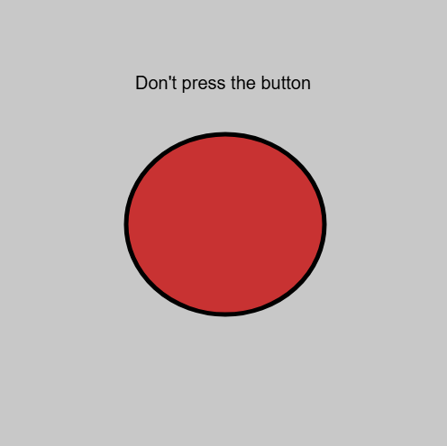

# Cart 253 Fall 2026

:sparkles: This website collects and showcases my prototyping work during the course while documenting my progress and learning. :sparkles:

## Useful links !

[Journal](journal.md)

## All my challenges

- [Instructions-challenge](topics/challenges/instructions-challenge/)
- [Variables-challenge](topics/challenges/variables-challenge/)
- [Conditions-challenge](topics/challenges/conditions-challenge/)

## All my prototypes

## Instructions assignement

### The Solar System

[The Solar System](https://leyfa01.github.io/cart253/topics/prototypes/instructions/instructions-prototype-1/)

[The Solar System Repositary](https://github.com/leyfa01/cart253/tree/main/topics/prototypes/instructions/instructions-prototype-1/)

### Geometric Chaos

[Geometric Chaos](https://leyfa01.github.io/cart253/topics/prototypes/instructions/instructions-prototype-2/)

[Geometric Chaos Repositary](https://github.com/leyfa01/cart253/tree/main/topics/prototypes/instructions/instructions-prototype-2/)

### Mood Bot

[Mood Bot](https://leyfa01.github.io/cart253/topics/prototypes/instructions/instructions-prototype-3/)

[Mood Bot Repositary](https://github.com/leyfa01/cart253/tree/main/topics/prototypes/instructions/instructions-prototype-3/)

## Variables assignement

### Up and Down

[Up and Down](https://leyfa01.github.io/cart253/topics/prototypes/variables/variables-prototype-1/)

[Up and Down Repositary](https://github.com/leyfa01/cart253/tree/main/topics/prototypes/variables/variables-prototype-1/)

### Hidden in the Dark

[Hidden in the Dark](https://leyfa01.github.io/cart253/topics/prototypes/variables/variables-prototype-2/)

[Hidden in the Dark Repositary](https://github.com/leyfa01/cart253/tree/main/topics/prototypes/variables/variables-prototype-2/)

### Grow and Shine

[Grow and Shine](https://leyfa01.github.io/cart253/topics/prototypes/variables/variables-prototype-3/)

[Grow and Shine Repositary](https://github.com/leyfa01/cart253/tree/main/topics/prototypes/variables/variables-prototype-3/)

### Feed the Panda

[Feed the Panda](https://leyfa01.github.io/cart253/topics/prototypes/conditions/condition-prototype-1/)

[Feed the Panda Repositary](https://github.com/leyfa01/cart253/tree/main/topics/prototypes/conditions/condition-prototype-1/)

### Find the Snowman

[Find the Snowman](https://leyfa01.github.io/cart253/topics/prototypes/conditions/condition-prototype-2/)

[Find the Snowman Repositary](https://github.com/leyfa01/cart253/tree/main/topics/prototypes/conditions/condition-prototype-2/)

### Don't press the Button

[Don't press the Button](https://leyfa01.github.io/cart253/topics/prototypes/conditions/condition-prototype-3/)

[Don't press the Button Repositary](https://github.com/leyfa01/cart253/tree/main/topics/prototypes/conditions/condition-prototype-3/)
