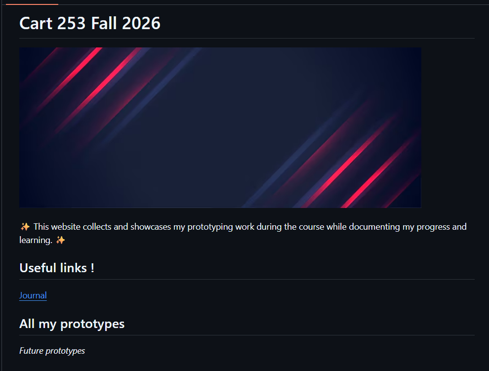

# Reflective Journal

### 14/09/2026

Since I studied programming at cegep, creating projects and using GitHub is not completely new to me. I have already worked with code and different programming tools before. However, this project helped me use Markdown in a different way than I was used to. I've usually used markdown to write a short description with a title but i've never used it to organize and list several projects like a portfolio.

It was cool to see that Markdown can be used for more than just describing a project. I liked being able to put different projects together in one place and make them easy to access. I also think it is useful because I can keep adding new projects in the future by just adding a new link to the page. What I found difficult was simply remembering to make my commits. When I'm focused I tend to just keep going and forget to commit.

I hope that people who visit my website in the future will understand my skills and the progress I've made. I want the website to look organized and professional. My goal is to continue adding projects and improving the website as I learn more.

### 22/09/2026

While making my three prototypes, I learned a lot about how p5.js works and how much you can create with simple shapes. For my first prototype, I made a solar system using circles, colors, and simple details to represent the Sun and the eight planets. It helped me understand basic functions like ellipse(), fill(), stroke().

For my second prototype, I experimented more with 2D and 3D shapes, rotations, layers, and different shape modes. One of the hardest parts was placing the bezier() curve exactly where I wanted it. Since it uses several coordinates, I had to keep changing the values until the curve looked right.

For my third prototype, I created a robot with different emotions. This was also challenging because I had to figure out how to create certain facial expressions. For example, for the happy robot, I wanted curved eyebrows, but I could not find a way to cut a 3D shape. Instead, I improvised by using a torus() and rotating and positioning it so that only part of it was visible, making it look like an eyebrow.

What surprised me the most was that there is not always one direct way to create something. Sometimes I had to experiment and find another solution. I would like to develop the robot further by adding movement and more interactive emotions.

