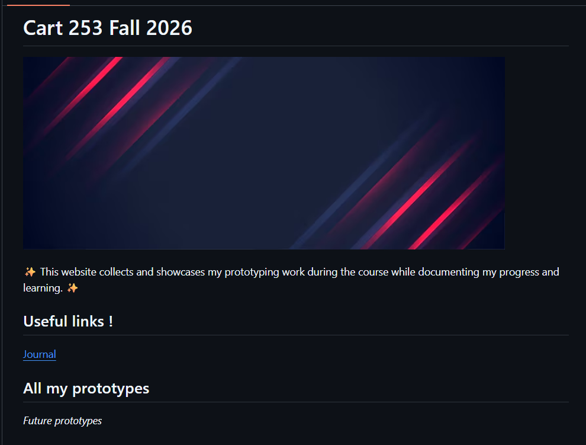

# Reflective Journal

### 14/09/2026

Since I studied programming at cegep, creating projects and using GitHub is not completely new to me. I have already worked with code and different programming tools before. However, this project helped me use Markdown in a different way than I was used to. I've usually used markdown to write a short description with a title but i've never used it to organize and list several projects like a portfolio.

It was cool to see that Markdown can be used for more than just describing a project. I liked being able to put different projects together in one place and make them easy to access. I also think it is useful because I can keep adding new projects in the future by just adding a new link to the page. What I found difficult was simply remembering to make my commits. When I'm focused I tend to just keep going and forget to commit.

I hope that people who visit my website in the future will understand my skills and the progress I've made. I want the website to look organized and professional. My goal is to continue adding projects and improving the website as I learn more.

### Instructions prototype - 22/09/2026

While making my three prototypes, I learned a lot about how p5.js works and how much you can create with simple shapes. For my first prototype, I made a solar system using circles, colors, and simple details to represent the Sun and the eight planets. It helped me understand basic functions like ellipse(), fill(), stroke().

For my second prototype, I experimented more with 2D and 3D shapes, rotations, layers, and different shape modes. One of the hardest parts was placing the bezier() curve exactly where I wanted it. Since it uses several coordinates, I had to keep changing the values until the curve looked right.

For my third prototype, I created a robot with different emotions. This was also challenging because I had to figure out how to create certain facial expressions. For example, for the happy robot, I wanted curved eyebrows, but I could not find a way to cut a 3D shape. Instead, I improvised by using a torus() and rotating and positioning it so that only part of it was visible, making it look like an eyebrow.

What surprised me the most was that there is not always one direct way to create something. Sometimes I had to experiment and find another solution. I would like to develop the robot further by adding movement and more interactive emotions.

### Variables prototype - 30/09/2026

While making these three prototypes, I learned more about movement, interaction, and how variables can change what happens on the screen in p5.js.

For my first prototype, Up and Down, I created a ball that moves vertically using velocity and acceleration. I learned how changing the acceleration can make the ball move in different directions and create a bouncing movement.

For my second prototype, I made a flashlight that follows the mouse and reveals a hidden red circle when the mouse gets close to it. I learned how to use mouseX and mouseY and how to check if the mouse is inside a certain area. The hardest part was figuring out when the mouse was close enough to the hidden circle and how to change its color at the right moment. What surprised me was that such simple shapes could create the feeling of a flashlight and make the prototype feel interactive.

For my third prototype, Grow and Shine, I used mouseClicked() to make the moon grow after each click. Once it reaches its maximum size, the colors change and the moon becomes the sun. This helped me understand if and else statements better.

What I found cool was seeing how small changes in variables could create movement, interaction, and transformation. I hope someone using my prototypes will see how simple code can create playful interactions. I would like to develop the flashlight prototype further by hiding several shapes around the canvas and turning it into a small searching game with a score or timer.

### Conditional prototype - 10/05/2026

For this assignment, I created three different prototypes using conditionals. My first prototype was a panda that reacts to bamboo. and the panda changes its mood depending on how close the bamboo is. My second prototype was a door game where the player has to find the snowman by choosing one of three doors. My third prototype was a red button that reacts differently every time the player clicks it.

What I learned from this assignment was how conditionals can make a program react to the user. I got better at using if, else if, and else to create different results, such as changing colors, showing objects, changing backgrounds, and displaying different messages.

Something that surprised me was how simple conditionals can make a program feel more interactive. For example, the red button is very simple, but the different messages and background changes make it feel like it is reacting to the player.

One difficult part was keeping an object visible after clicking. At first, the snowman disappeared quickly because the background updates every frame. I learned that I needed to save the click result in a variable and use that variable in draw() so the snowman could stay visible.

I hope someone playing my prototypes can quickly understand how to interact with them and enjoy the different reactions. If I developed one project further, I would improve the door game by adding more surprises and making the doors open with an animation.

